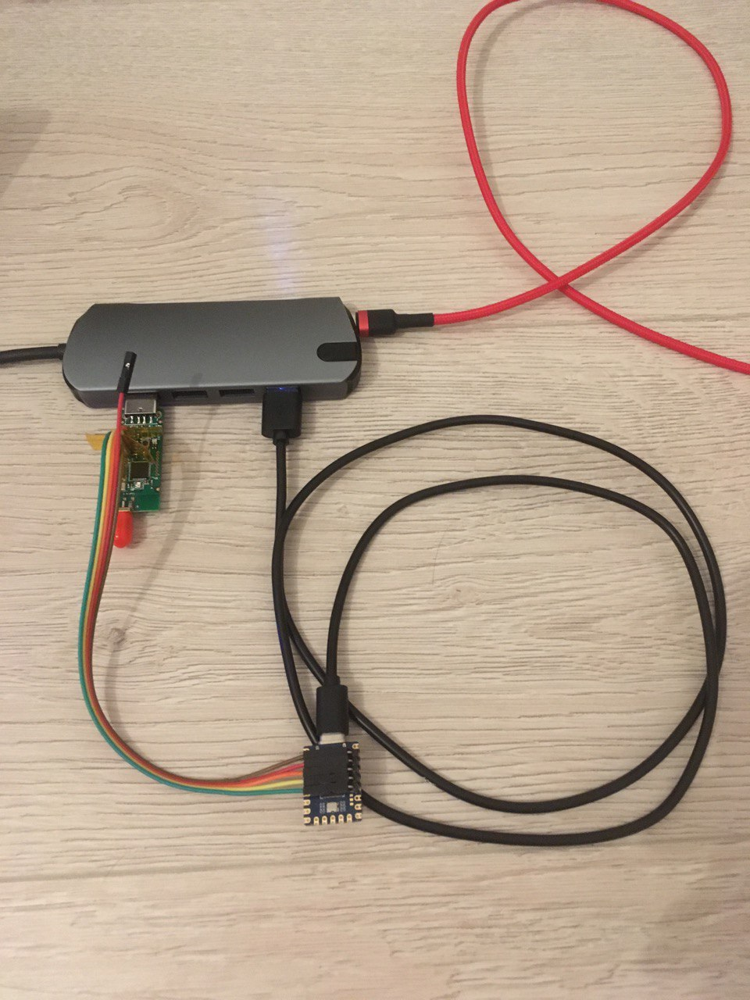
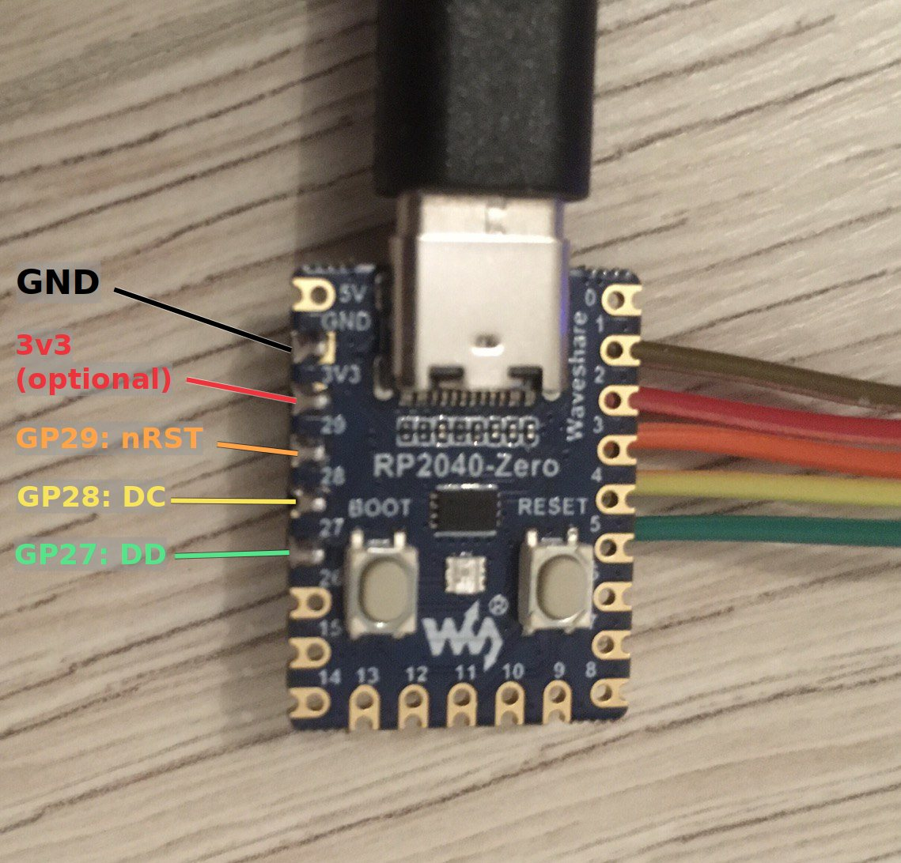
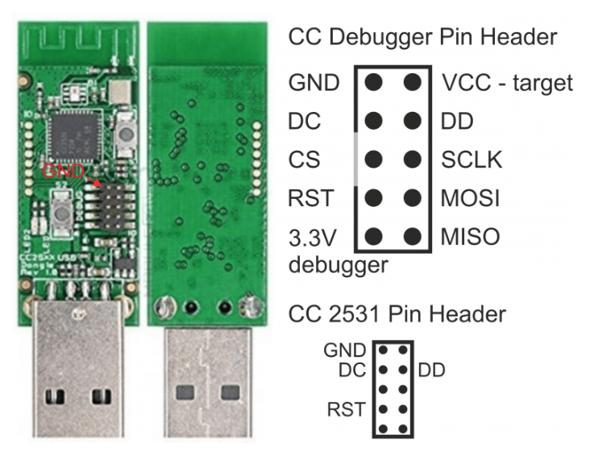
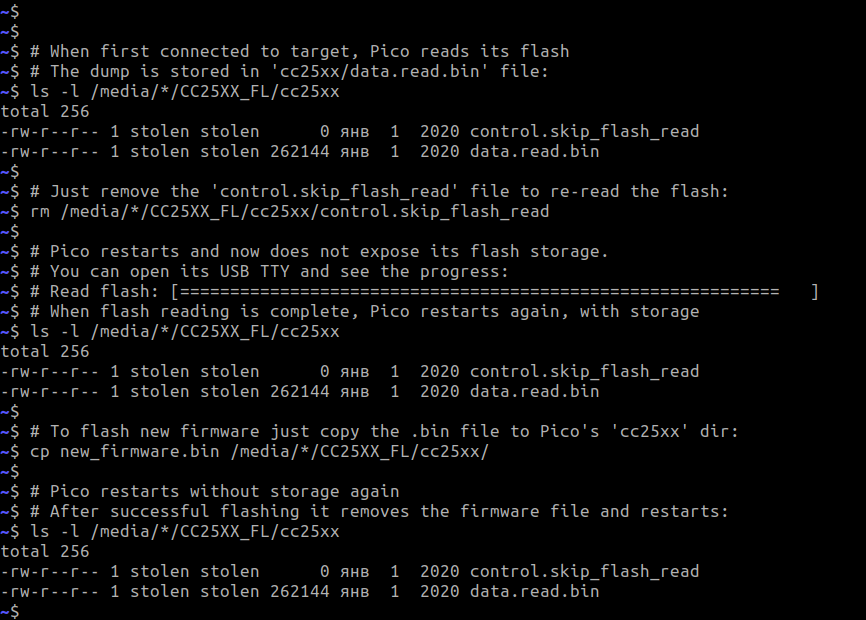
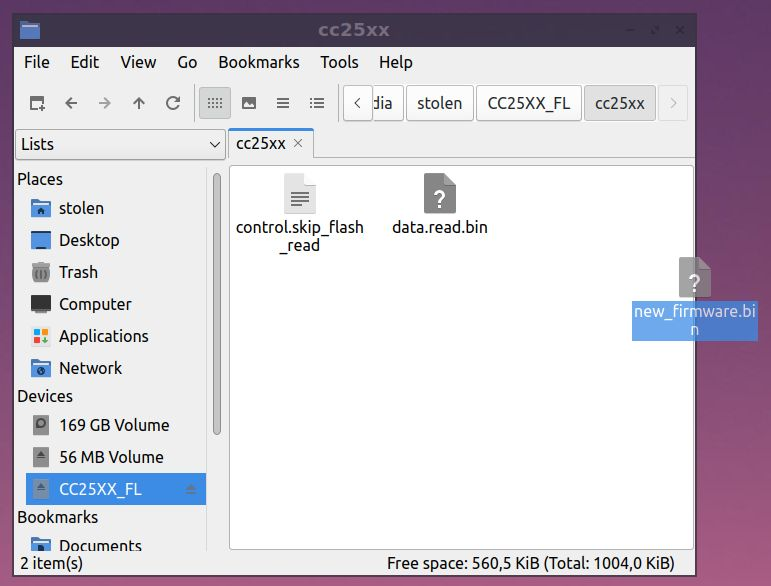

# Standalone CC25xx firmware flasher
## Features
  * No need for software on your PC
  * Works in any OS
  * Easy to use -- just drop new firmware to the USB storage

## Installation
  
  * Grab any RP2040 board
  * Connect some pins to your CC2531 stick
    * `GND   ->    GND`
    * `GP27  ->    DD`
    * `GP28  ->    DC`
    * `GP29  ->   nRST`
  * Automated installation
    * Connect your RP2040 board in bootloader mode to your PC
    * run `make install`
  * Manual installation
    * Install [CircuitPython](https://circuitpython.org/downloads)
    * Unzip [release zip](https://github.com/stolen/pico_cc_flasher/releases/latest/download/pico_cc_flasher.zip) into a CircuitPython USB drive
    * _(Alternate to unzipping)_ Copy all `*.py` files from this repo to your RP2040 (don't forget about `lib/adafruit_pioasm.py`)
  * RP2040 will restart automatically

## Usage
 
  * Connect to your computer and to CC2531 stick
  * On first boot or when first connected to a target the flash dump will be read
  * On the USB drive open directory `cc25xx`
  * `data.read.bin` is the flash dump
  * Remove `control.skip_flash_read` to re-read flash
  * Drop any `*.bin` file (except `data.read.bin`) to this directory to flash it
  * Open USB TTY to see operation progress and some logs

## How it works
  * Basic debugger protocol is implemented in RP2040 PIO
  * Higher-level code is written in Python

## Customizing
  * You may want to remove or isolate `neopixel` calls from `cc25xx_ui.py` if your board does not support it
  * Change pins in `cc25xx_proto.py` -- look for `pinDD`, `pinDC`, `pinRST` vars near the top
  * If reading or writing catches some errors or hangs, try chhosing a lower `pio_frequency` in `cc25xx_proto.py`

## TODO (PRs welcome)
  * Discover way to indicate activity -- LED, NEOPIXEL or just no indication
  * Accept `.hex` files (no need for conversion)
  * Support for chips other than CC2530/CC2531 (flash size, etc.)
  * Erase only affected flash blocks like [CCLib for Arduino](https://github.com/wavesoft/CCLib/blob/13ebd0878a8a691d1336b96609eb44d535021964/Python/cclib/chip/cc254x.py#L570) does
  * DMA read for better speed (if possible at all)
